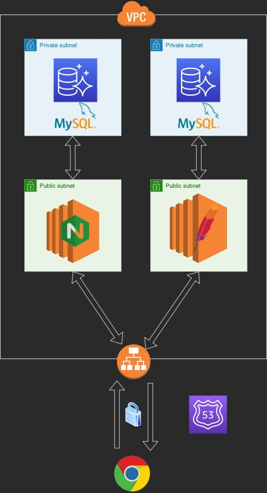

# EC2-CFn Templates

図のような構成の HTTPS 化した EC2 の Coudformation テンプレート


## Getting started

Route53 でドメイン（このチュートリアルでは souhub-example.com）を取得し、NameSpace を作成。
ACM で証明書発行。
以下のコマンド実行後、Route53 に CNAME レコードを作成（ACM のページから手動で）。

```
$ make acm
```

VPC、Subnet、Internet Gateway、Route など作成

```
$ make vpc
```

SecurityGroup 作成

```
$ make sg
```

EC2 インスタンス作成

```
$ make ec2
```

ALB、TargetGroup、Lisner 作成

```
$ make alb
```

手動で Route53 で Alias に ALB の DNS を選択し、[www.souhub-example.com](https://www.souhub.example.com)と紐づける
